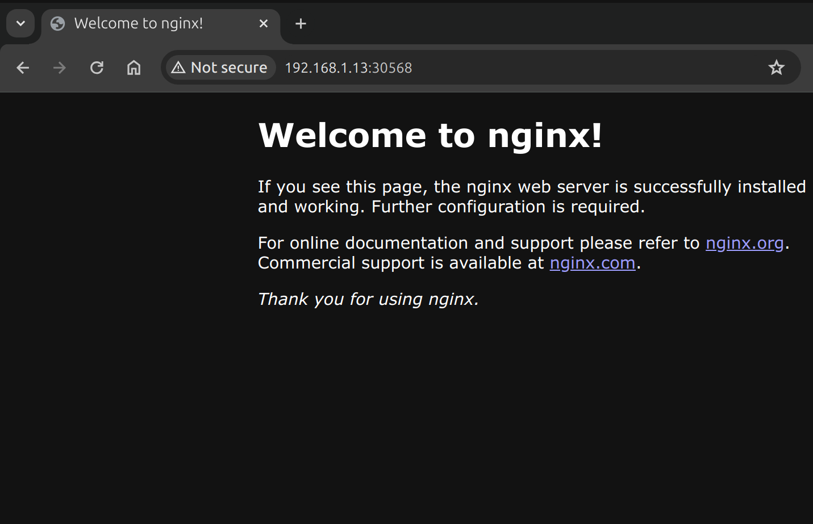

# Домашнее задание к занятию «Сетевое взаимодействие в K8S. Часть 1»

### Цель задания

В тестовой среде Kubernetes необходимо обеспечить доступ к приложению, установленному в предыдущем ДЗ и состоящему из двух контейнеров, по разным портам в разные контейнеры как внутри кластера, так и снаружи.

------

### Чеклист готовности к домашнему заданию

1. Установленное k8s-решение (например, MicroK8S).
2. Установленный локальный kubectl.
3. Редактор YAML-файлов с подключённым Git-репозиторием.

------

### Инструменты и дополнительные материалы, которые пригодятся для выполнения задания

1. [Описание](https://kubernetes.io/docs/concepts/workloads/controllers/deployment/) Deployment и примеры манифестов.
2. [Описание](https://kubernetes.io/docs/concepts/services-networking/service/) Описание Service.
3. [Описание](https://github.com/wbitt/Network-MultiTool) Multitool.

------

### Задание 1. Создать Deployment и обеспечить доступ к контейнерам приложения по разным портам из другого Pod внутри кластера

1. Создать Deployment приложения, состоящего из двух контейнеров (nginx и multitool), с количеством реплик 3 шт.
2. Создать Service, который обеспечит доступ внутри кластера до контейнеров приложения из п.1 по порту 9001 — nginx 80, по 9002 — multitool 8080.
3. Создать отдельный Pod с приложением multitool и убедиться с помощью `curl`, что из пода есть доступ до приложения из п.1 по разным портам в разные контейнеры.

    [multitool pod](./multitools-pod.yml)

4. Продемонстрировать доступ с помощью `curl` по доменному имени сервиса.

```bash
ols@X12:~/homeworks/kuber-homeworks/1.4$ kubectl exec -it multitool-pod -- curl nginx-mtool-svc:9001
E0301 21:06:27.213606   42757 memcache.go:265] couldn't get current server API group list: Get "http://localhost:8080/api?timeout=32s": dial tcp 127.0.0.1:8080: connect: connection refused
E0301 21:06:27.214176   42757 memcache.go:265] couldn't get current server API group list: Get "http://localhost:8080/api?timeout=32s": dial tcp 127.0.0.1:8080: connect: connection refused
E0301 21:06:27.215818   42757 memcache.go:265] couldn't get current server API group list: Get "http://localhost:8080/api?timeout=32s": dial tcp 127.0.0.1:8080: connect: connection refused
E0301 21:06:27.216183   42757 memcache.go:265] couldn't get current server API group list: Get "http://localhost:8080/api?timeout=32s": dial tcp 127.0.0.1:8080: connect: connection refused
The connection to the server localhost:8080 was refused - did you specify the right host or port?
ols@X12:~/homeworks/kuber-homeworks/1.4$ microk8s kubectl exec -it multitool-pod -- curl nginx-mtool-s
vc:9001
<!DOCTYPE html>
<html>
<head>
<title>Welcome to nginx!</title>
<style>
html { color-scheme: light dark; }
body { width: 35em; margin: 0 auto;
font-family: Tahoma, Verdana, Arial, sans-serif; }
</style>
</head>
<body>
<h1>Welcome to nginx!</h1>
<p>If you see this page, the nginx web server is successfully installed and
working. Further configuration is required.</p>

<p>For online documentation and support please refer to
<a href="http://nginx.org/">nginx.org</a>.<br/>
Commercial support is available at
<a href="http://nginx.com/">nginx.com</a>.</p>

<p><em>Thank you for using nginx.</em></p>
</body>
</html>
```

```bash
ols@X12:~/homeworks/kuber-homeworks/1.4$ microk8s kubectl exec -it multitool-pod -- curl nginx-mtool-svc:9002
Praqma Network MultiTool (with NGINX) - nginx-mtool-app-75bb448c7b-vbf8l - 10.1.152.11 - HTTP: 8080 , HTTPS: 11443
<br>
<hr>
<br>

<h1>05 Jan 2022 - Press-release: `Praqma/Network-Multitool` is now `wbitt/Network-Multitool`</h1>

<h2>Important note about name/org change:</h2>
<p>
Few years ago, I created this tool with Henrik Høegh, as `praqma/network-multitool`. Praqma was bought by another company, and now the "Praqma" brand is being dismantled. This means the network-multitool's git and docker repositories must go. Since, I was the one maintaining the docker image for all these years, it was decided by the current representatives of the company to hand it over to me so I can continue maintaining it. So, apart from a small change in the repository name, nothing has changed.<br>
</p>
<p>
The existing/old/previous container image `praqma/network-multitool` will continue to work and will remain available for **"some time"** - may be for a couple of months - not sure though. 
</p>
<p>
- Kamran Azeem <kamranazeem@gmail.com> <a href=https://github.com/KamranAzeem>https://github.com/KamranAzeem</a>
</p>

<h2>Some important URLs:</h2>

<ul>
  <li>The new official github repository for this tool is: <a href=https://github.com/wbitt/Network-MultiTool>https://github.com/wbitt/Network-MultiTool</a></li>

  <li>The docker repository to pull this image is now: <a href=https://hub.docker.com/r/wbitt/network-multitool>https://hub.docker.com/r/wbitt/network-multitool</a></li>
</ul>

<br>
Or:
<br>

<pre>
  <code>
  docker pull wbitt/network-multitool
  </code>
</pre>


<hr>
```

5. Предоставить манифесты Deployment и Service в решении, а также скриншоты или вывод команды п.4.

    [Deployment](./nginx-multitool-app.yml)

    [Service](./nginx-multitool-svc.yml)

------

### Задание 2. Создать Service и обеспечить доступ к приложениям снаружи кластера

1. Создать отдельный Service приложения из Задания 1 с возможностью доступа снаружи кластера к nginx, используя тип NodePort.

```bash
ols@ubuntults:~/homeworks/kuber-homeworks/1.4$ microk8s kubectl get services -w
NAME                 TYPE        CLUSTER-IP      EXTERNAL-IP   PORT(S)                         AGE
kubernetes           ClusterIP   10.152.183.1    <none>        443/TCP                         4d
nginx-mtool-svc      ClusterIP   10.152.183.60   <none>        9001/TCP,9002/TCP               3d23h
nginx-mtool-svc-np   NodePort    10.152.183.97   <none>        9001:30568/TCP,9002:32333/TCP   9m56s
```
2. Продемонстрировать доступ с помощью браузера или `curl` с локального компьютера.

    

```bash
ols@X12:~/homeworks/kuber-homeworks/1.4$ curl 192.168.1.13:30080
<!DOCTYPE html>
<html>
<head>
<title>Welcome to nginx!</title>
<style>
html { color-scheme: light dark; }
body { width: 35em; margin: 0 auto;
font-family: Tahoma, Verdana, Arial, sans-serif; }
</style>
</head>
<body>
<h1>Welcome to nginx!</h1>
<p>If you see this page, the nginx web server is successfully installed and
working. Further configuration is required.</p>

<p>For online documentation and support please refer to
<a href="http://nginx.org/">nginx.org</a>.<br/>
Commercial support is available at
<a href="http://nginx.com/">nginx.com</a>.</p>

<p><em>Thank you for using nginx.</em></p>
</body>
</html>
```
```bash
ols@X12:~/homeworks/kuber-homeworks/1.4$ curl 192.168.1.13:31443
Praqma Network MultiTool (with NGINX) - nginx-mtool-app-75bb448c7b-qshqp - 10.1.152.9 - HTTP: 8080 , HTTPS: 11443
<br>
<hr>
<br>

<h1>05 Jan 2022 - Press-release: `Praqma/Network-Multitool` is now `wbitt/Network-Multitool`</h1>

<h2>Important note about name/org change:</h2>
<p>
Few years ago, I created this tool with Henrik Høegh, as `praqma/network-multitool`. Praqma was bought by another company, and now the "Praqma" brand is being dismantled. This means the network-multitool's git and docker repositories must go. Since, I was the one maintaining the docker image for all these years, it was decided by the current representatives of the company to hand it over to me so I can continue maintaining it. So, apart from a small change in the repository name, nothing has changed.<br>
</p>
<p>
The existing/old/previous container image `praqma/network-multitool` will continue to work and will remain available for **"some time"** - may be for a couple of months - not sure though. 
</p>
<p>
- Kamran Azeem <kamranazeem@gmail.com> <a href=https://github.com/KamranAzeem>https://github.com/KamranAzeem</a>
</p>

<h2>Some important URLs:</h2>

<ul>
  <li>The new official github repository for this tool is: <a href=https://github.com/wbitt/Network-MultiTool>https://github.com/wbitt/Network-MultiTool</a></li>

  <li>The docker repository to pull this image is now: <a href=https://hub.docker.com/r/wbitt/network-multitool>https://hub.docker.com/r/wbitt/network-multitool</a></li>
</ul>

<br>
Or:
<br>

<pre>
  <code>
  docker pull wbitt/network-multitool
  </code>
</pre>


<hr>
```

3. Предоставить манифест и Service в решении, а также скриншоты или вывод команды п.2.

    [Service](nginx-mtool-svc-nodeport.yml)


------

### Правила приёма работы

1. Домашняя работа оформляется в своем Git-репозитории в файле README.md. Выполненное домашнее задание пришлите ссылкой на .md-файл в вашем репозитории.
2. Файл README.md должен содержать скриншоты вывода необходимых команд `kubectl` и скриншоты результатов.
3. Репозиторий должен содержать тексты манифестов или ссылки на них в файле README.md.
